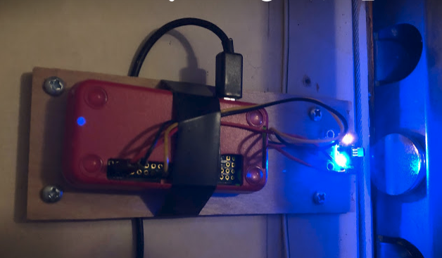
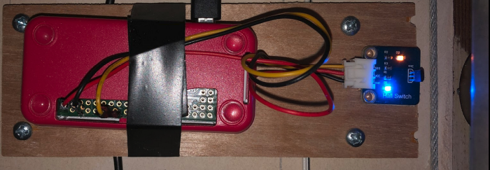

# Raspberry Pi garage door monitor

## Overview
A REST API service that monitors a garage door and sends text message if the door is open longer than specified time

### Features
* Programmable and changeable notification delay
* Simple readable status from a browser (example https://virtserver.swaggerhub.com/rainy_day/door_status/1.0.0/status)
* Ability to send text message for testing
* Testing mode that doesn't require any hardware (can fake input using API)

## Hardware
Required:
* Raspberry Pi Zero W connected on local network
* A Hall switch sensor soldered to an input pin (pin 23 in this case), see https://www.amazon.com/gp/product/B013G5N03O
* A strong magnet placed on the garage door, example: https://www.amazon.com/gp/product/B06XD2X45M
* Raspberry Pi mounted such that the Hall switch is close to the magnet and detects when the door is closed

Reference pictures: \



## Software
This server was generated by the [swagger-codegen](https://github.com/swagger-api/swagger-codegen) project.  By using the [OpenAPI-Spec](https://github.com/OAI/OpenAPI-Specification) from a remote server, you can easily generate a server stub.

### Running the server
First, write `.env` file to set API key and runtime mode (test/debug/prod), and place it in the root folder. Set mode to `test` for no hardware, or `prod` with hardware.
\
Also, set from/to email addresses and the gmail app password (settable in gmail account settings)
\
Example `.env` file:
```
API_KEY=<your key of choice>
MODE=test
EMAIL_FROM=<user>@gmail.com
EMAIL_TO=<email_address>
EMAIL_PASSWORD=<gmail app password>
```

Start the server by running:
```
npm start
```

To view the Swagger UI interface:

```
open http://localhost:8080/docs
```

